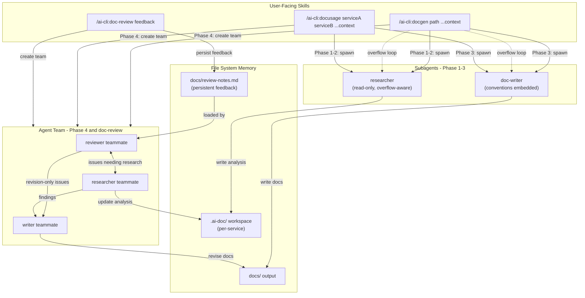
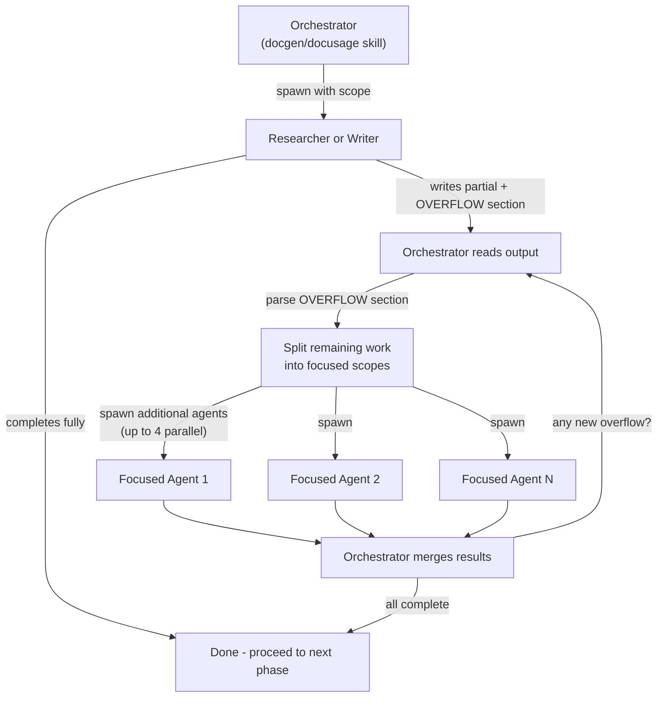
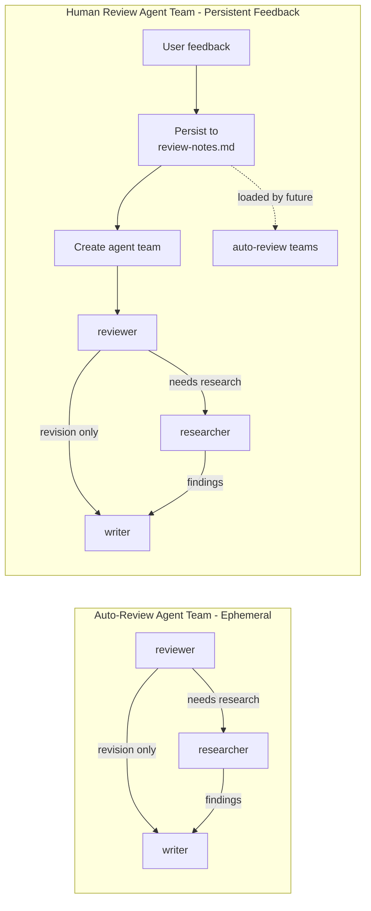

# AI CLI Plugin Architecture Plan

## Plugin Identity

A Claude Code plugin at the root of the repo. The plugin manifest at `.claude-plugin/plugin.json`:

```json
{
  "name": "ai-cli",
  "description": "AI-powered documentation generation, cross-service usage analysis, and doc review for codebases",
  "version": "0.1.0",
  "author": { "name": "stevenqin" }
}
```

Users load it with `claude --plugin-dir /path/to/ai-cli-v3` and invoke `/ai-cli:docgen`, `/ai-cli:docusage`, or `/ai-cli:doc-review`.

---

## Why Skills, Not Commands

Claude Code has merged `commands/` and `skills/` -- both create `/slash-commands`. The `skills/` approach is recommended because:

- Skills support YAML frontmatter (`disable-model-invocation`, `allowed-tools`, `context: fork`, etc.)
- Skills can have supporting files (templates, guides) in their directory

**Critical constraint**: A skill with `context: fork` runs inside a subagent, and **subagents cannot spawn other subagents**. Therefore, the orchestrator skills (`docgen`, `docusage`, `doc-review`) must run **inline** (no `context: fork`) so they can spawn subagents and create agent teams during execution.

---

## Prerequisites

- Claude Code v1.0.33+ (for plugin support)
- **Agent teams enabled**: Phase 4 (auto-review) and doc-review use the experimental agent teams feature. Enable it by adding to your settings.json or environment:
  ```json
  {
    "env": {
      "CLAUDE_CODE_EXPERIMENTAL_AGENT_TEAMS": "1"
    }
  }
  ```
  See [Agent Teams docs](https://code.claude.com/docs/en/agent-teams) for details. Agent teams have known limitations around session resumption and shutdown -- these are acceptable for our one-round review use case since the team is short-lived.

---

## Directory Layout

```
ai-cli-v3/
├── .claude-plugin/
│   └── plugin.json                      # Plugin manifest
├── skills/
│   ├── docgen/                          # /ai-cli:docgen -- doc generation orchestrator
│   │   ├── SKILL.md                     # Main orchestrator (4 phases + overflow loop)
│   │   ├── analysis-guide.md            # How to analyze components (ref for researcher)
│   │   └── templates/
│   │       ├── project-overview.md      # Template: project README
│   │       ├── workflow-doc.md          # Template: per-workflow doc
│   │       └── api-doc.md              # Template: per-API-group doc
│   ├── docusage/                        # /ai-cli:docusage -- usage analysis orchestrator
│   │   ├── SKILL.md                     # Main orchestrator (4 phases + overflow loop)
│   │   ├── tracing-guide.md             # How to trace cross-service usage
│   │   └── templates/
│   │       ├── usage-overview.md        # Template: usage summary
│   │       └── usage-workflow-doc.md    # Template: per-workflow usage doc
│   └── doc-review/                      # /ai-cli:doc-review -- human review + revision
│       ├── SKILL.md                     # Review orchestrator (research-first, then revise)
│       └── review-checklist.md          # Quality criteria reference
├── agents/
│   ├── researcher.md                    # Read-only codebase analysis subagent
│   ├── doc-writer.md                    # Documentation writer subagent (conventions embedded)
│   └── doc-reviewer.md                  # Documentation quality reviewer subagent
├── plan/                                # Plan documents
└── README.md                            # Plugin installation + usage guide
```

**No separate `doc-conventions` skill.** Writing conventions (style rules, splitting heuristics, reference formatting) are embedded directly in the `doc-writer` agent's system prompt. Templates live as supporting files within each skill directory. This avoids a skill that is never invoked as a command -- it was purely reference material, and the agent's markdown body is the right place for that.

---

## Architecture Overview



---

## Core Components

### 1. Skills (User-Facing Orchestrators)

#### `skills/docgen/SKILL.md` -- `/ai-cli:docgen <path> [additional context]`

- **Frontmatter**: `disable-model-invocation: true` (user-invoked only)
- **Runs inline** (no `context: fork`) so it can spawn subagents
- **Arguments**:
  - `$ARGUMENTS[0]` = **required** path to repo/service to document
  - `$ARGUMENTS[1...]` = **optional** additional context from the user (e.g., "API docs are at docs/openapi.yaml", "focus on the auth module", "this is a Go microservice using gRPC")
  - The additional context is passed to researcher subagents as supplementary instructions

**Argument examples**:

```
/ai-cli:docgen ./services/auth
/ai-cli:docgen ./services/auth The OpenAPI spec is at api/openapi.yaml, focus on OAuth flows
/ai-cli:docgen . This is a Python Django project, main app is in src/
```

The orchestrator runs 4 phases with an **overflow loop**:

**Phase 1 -- Discovery**

- Spawn `researcher` subagent to scan the repo at the given path
- Pass any user-provided additional context to the researcher
- Identify: services/modules, entry points, APIs, config, key data models, external dependencies
- Write structured inventory to `<path>/.ai-doc/docgen/discovery/repo-map.md`
- Write component list to `<path>/.ai-doc/docgen/discovery/components.md`
- Instruct researcher to reference `analysis-guide.md` for what to look for
- **Overflow check**: if researcher reports overflow, split the discovery scope and spawn additional researchers for uncovered areas (see [Overflow Protocol](#overflow-protocol))
- Decision gate: if repo is small (fewer than ~5 components), combine Phase 1+2

**Phase 2 -- Deep Analysis**

- Read the discovered components list from `.ai-doc/docgen/discovery/components.md`
- For each component, spawn `researcher` subagent (up to 4 parallel)
- Each subagent writes to `<path>/.ai-doc/docgen/analysis/<component-name>.md`
- Analysis covers: purpose, responsibilities, key interfaces, dependencies (in/out), participation in workflows
- Focus on "why" not "what" -- summarize with file path references (e.g., `see src/auth/handler.go:45-80`), do not copy-paste code
- **Overflow check**: after each researcher returns, check for `## OVERFLOW` section. If present, spawn additional researchers scoped to the overflow areas

**Phase 3 -- Synthesis**

- Read all files in `<path>/.ai-doc/docgen/analysis/`
- Spawn `doc-writer` subagent to generate final docs
- Pass template file paths from `skills/docgen/templates/` so the writer can reference them
- Apply splitting rules: if a section exceeds ~300 lines, split into a folder with `README.md` index
- Write final output to `docs/` in target path
- **Overflow check**: if writer reports overflow, split output by domain and spawn additional writers for remaining sections

**Phase 4 -- Auto-Review (Agent Team)**

Instead of sequential subagent calls, Phase 4 creates a **review agent team** where the reviewer, researcher, and writer collaborate as teammates. This lets the reviewer directly tell the researcher what to investigate, and the researcher directly share findings with the writer -- no bottleneck through the orchestrator.

- Orchestrator creates an agent team with 3 teammates:
  - **Reviewer teammate**: reads the generated docs in `docs/`, checks against `review-checklist.md` and `docs/review-notes.md`. Identifies issues and triages each as "needs research" or "revision only"
  - **Researcher teammate**: receives research requests from reviewer, investigates the codebase, updates analysis files in `.ai-doc/`, shares findings with writer
  - **Writer teammate**: receives revision instructions from reviewer (for style/structure fixes) and research findings from researcher (for content fixes), revises the affected doc files
- Teammates communicate directly via inter-agent messaging -- reviewer messages researcher for investigation, researcher messages writer with findings, reviewer messages writer for simple fixes
- The team completes after **one round** of review+fix. The orchestrator waits for the team to finish, then cleans up
- All auto-review feedback is **ephemeral** (not persisted to review-notes.md) to avoid context bloat
- Requires `CLAUDE_CODE_EXPERIMENTAL_AGENT_TEAMS=1` in settings (see [Prerequisites](#prerequisites))

**Output structure** (workflows as primary organizing principle):

```
docs/
├── README.md                      # Project overview: what it does, architecture diagram
│                                  #   (mermaid), tech stack, getting started pointers
├── workflows/
│   ├── README.md                  # Workflow index: name + 1-line summary + link
│   └── <workflow>.md              # Per-workflow: trigger, steps, which components
│                                  #   participate and why, sequence diagram, data flow
│                                  #   (components are explained in workflow context)
└── api/
    ├── README.md                  # API index: grouped by domain, links to details
    └── <api-group>.md             # Per-API-group: endpoints, behavior summary,
                                   #   cross-references to workflows where each
                                   #   endpoint is triggered/used
```

No separate `architecture/` folder. Components/services are explained within the workflows they participate in. The project `README.md` covers architecture at a high level with a mermaid diagram, and workflows give the detailed component-by-component breakdown.

---

#### `skills/docusage/SKILL.md` -- `/ai-cli:docusage <serviceA> <serviceB> [additional context]`

- **Frontmatter**: `disable-model-invocation: true`
- **Runs inline** (no `context: fork`)
- **Arguments**:
  - `$ARGUMENTS[0]` = **required** serviceA path (the service being consumed)
  - `$ARGUMENTS[1]` = **required** serviceB path (the consumer)
  - `$ARGUMENTS[2...]` = **optional** additional context (e.g., "serviceA exposes a gRPC API", "check the event bus integration")

4-phase orchestrator (same overflow loop as docgen):

**Phase 1 -- Interface Analysis**

- Spawn `researcher` subagent to analyze Service A's public interface
- Pass any user-provided additional context
- Identify: exported APIs, events emitted, shared data models, config hooks
- Write to `<serviceA>/.ai-doc/docusage/interfaces.md`
- Reference `tracing-guide.md` for patterns to look for
- **Overflow check**: split if needed

**Phase 2 -- Usage Tracing**

- Spawn `researcher` subagent to scan Service B for all interactions with Service A
- For each interaction: what is called, why (business reason), trigger from B's perspective, data flow direction
- Group findings by workflow/feature
- Write to `<serviceA>/.ai-doc/docusage/used-by-<serviceB>/analysis.md`
- **Overflow check**: split if needed

**Phase 3 -- Synthesis**

- Read analysis files from `<serviceA>/.ai-doc/docusage/`
- Spawn `doc-writer` subagent to generate final usage docs
- Apply splitting rules for large output
- **Overflow check**: split if needed

**Phase 4 -- Auto-Review (Agent Team)**

- Same pattern as docgen: create a review agent team (reviewer + researcher + writer teammates), one round of collaborative review, ephemeral feedback

**Output structure**:

```
docs/<serviceA>/usage/
├── README.md                      # Index: summary of how A is consumed, link to each consumer
└── <serviceB>/
    ├── README.md                  # Overview: why B uses A, dependency diagram, summary
    └── workflows/
        ├── README.md              # Workflow index
        └── <workflow>.md          # Per-workflow: trigger in B, call chain into A,
                                   #   data flow, sequence diagram, business reason
```

---

#### `skills/doc-review/SKILL.md` -- `/ai-cli:doc-review <feedback>`

- **Frontmatter**: `disable-model-invocation: true`
- **Runs inline**
- **Arguments**: `$ARGUMENTS` = human feedback text (what to fix, what's wrong, what's missing)

This skill runs a **research-first** revision workflow using an **agent team**:

**Step 1 -- Persist human feedback**

- Append the user's feedback to `<path>/docs/review-notes.md` with a timestamp
- This file is **persistent across runs** -- it accumulates human review notes over time
- Future auto-review phases (Phase 4 of docgen/docusage) load this file so the doc-reviewer agent checks against past human feedback
- This creates a learning loop: human points out an issue once, all future auto-reviews catch similar issues

**Step 2 -- Create revision agent team**

The orchestrator creates an agent team with 3 teammates, seeding the team with the user's feedback:

- **Reviewer teammate**: reads the user's feedback, examines the current docs, and triages each issue as "needs research" (missing info, wrong analysis) or "revision only" (style, structure, presentation). Messages the researcher for investigation tasks and the writer for direct fixes.
- **Researcher teammate**: receives investigation requests from the reviewer, explores the codebase to find the missing information, updates/creates analysis files in `.ai-doc/`, and shares findings with the writer.
- **Writer teammate**: receives revision instructions from both the reviewer (simple fixes) and the researcher (content based on new findings), revises only the affected doc files.

The key advantage over sequential subagents: the reviewer can triage multiple issues in parallel. Some go to the researcher, others go directly to the writer. The researcher and writer work simultaneously on different issues. The team self-coordinates via direct messaging without routing everything through the orchestrator.

**Step 3 -- Team completes**

- The orchestrator waits for the team to finish (one round of review + fix)
- Cleans up the team
- Human feedback remains persisted in `review-notes.md` for future auto-reviews

**Example invocations**:

```
/ai-cli:doc-review The workflow docs for auth are missing the OAuth refresh token flow
/ai-cli:doc-review The API docs should mention rate limiting behavior for all endpoints
/ai-cli:doc-review serviceA usage docs don't explain why serviceB calls the batch endpoint
```

---

### 2. Agents (Execution Contexts)

#### `agents/researcher.md`

```yaml
name: researcher
description: Read-only codebase researcher for analyzing project structure, components, APIs, and cross-service interactions. Use proactively when exploring or analyzing code.
tools: Read, Grep, Glob, Bash
disallowedTools: Write, Edit
model: sonnet
memory: project
```

**System prompt highlights**:

- Produce structured, concise analysis in markdown
- Summarize with file path references (`see path/to/file.go:45-80`) rather than copying code
- Focus on purpose, design intent, and relationships
- When analyzing a component: what it does, why it exists, what depends on it, and what it depends on
- **Overflow protocol**: If the scope is too large to fully analyze in a single pass, write what you can and add a `## OVERFLOW` section at the end listing: areas not yet covered, suggested scope splits, and why each area matters. The orchestrator will spawn additional researchers for overflow areas.

**Memory**: `project` scope -- the researcher accumulates codebase knowledge (architectural patterns, key paths, naming conventions) across sessions, making repeat analyses faster.

#### `agents/doc-writer.md`

```yaml
name: doc-writer
description: Documentation writer that generates well-structured docs from analysis files.
tools: Read, Write, Glob, Edit
model: sonnet
```

**System prompt highlights** (conventions embedded directly, no separate skill):

Writing conventions:

- Write for someone who has never seen this project
- Lead with "why" (purpose, business reason) before "what" (implementation details)
- Use mermaid diagrams for architecture and data flow
- Use sequence diagrams for multi-step workflows
- Reference code by file path + line range, never paste more than 5 lines
- Keep each doc file under ~300 lines; split into folder + README.md index if larger
- Every folder has a README.md as index with links and 1-line descriptions
- API docs must cross-reference workflows: "This endpoint is called during [Workflow X](../workflows/x.md)"
- Tone: technical but approachable, no jargon without a brief explanation

Operational instructions:

- Read analysis files from the `.ai-doc/` workspace directory
- Synthesize into clear, user-friendly documentation
- Cross-reference related docs with relative links
- **Overflow protocol**: If the output scope is too large (too many workflows, too many APIs), write what you can and add a `## OVERFLOW` section listing: sections not yet written, suggested domain splits, and what analysis files each split needs. The orchestrator will spawn additional writers.

#### `agents/doc-reviewer.md`

```yaml
name: doc-reviewer
description: Reviews generated documentation for quality, completeness, and adherence to conventions. Use after doc generation to catch issues.
tools: Read, Grep, Glob
disallowedTools: Write, Edit
model: sonnet
```

**System prompt highlights**:

- Review the generated docs against the quality checklist in `review-checklist.md`
- Also read `docs/review-notes.md` if it exists for persistent human feedback to check against
- Produce a structured review: issues found (severity: high/medium/low), specific file + section, suggested fix, and whether the fix requires **research** (re-analyzing code) or just **revision** (rewriting docs)
- Be concise -- only flag real problems, not style nitpicks
- Focus on: missing workflows, incorrect cross-references, unexplained jargon, code dumps that should be summaries, missing "why" explanations

---

## Overflow Protocol

Large repos/services can exceed what a single subagent can handle in one context window. The overflow protocol prevents information loss:



**How it works**:

1. Orchestrator spawns an agent (researcher or writer) with a defined scope
2. Agent works through the scope. If it can complete fully, it does -- no overflow
3. If the scope is too large, the agent writes what it can and appends a `## OVERFLOW` section:
   ```markdown
   ## OVERFLOW
   The following areas were not covered due to scope size:
   - `src/billing/` -- payment processing logic, ~15 files (suggest: separate researcher)
   - `src/notifications/` -- event handlers and templates, ~8 files (suggest: separate researcher)
   - API group: admin endpoints -- 12 endpoints not yet documented (suggest: separate writer)
   ```
4. Orchestrator reads the output, parses the OVERFLOW section
5. Spawns additional agents scoped to each overflow area (up to 4 parallel)
6. Repeats until no overflow remains
7. Merges all partial outputs into the final result

**Key properties**:

- No information is lost -- everything either gets analyzed/written or gets queued for a focused agent
- Agents self-report; the orchestrator doesn't guess scope limits
- The loop is bounded: each iteration handles a strict subset, so it converges
- Works for both researchers (analysis) and writers (doc generation)

---

## Working Memory Convention

Intermediate analysis files are stored **inside the service directory** under `.ai-doc/`:

- `<serviceA>/.ai-doc/docgen/discovery/` -- Phase 1 output
- `<serviceA>/.ai-doc/docgen/analysis/` -- Phase 2 output
- `<serviceA>/.ai-doc/docusage/` -- Usage analysis output

Each service gets its own `.ai-doc/` directory. This means you can analyze `serviceA`, `serviceB`, and `serviceC` independently -- each service's working memory lives inside it and doesn't interfere with the others. For single-repo projects, this is just `.ai-doc/` at the repo root.

**Why inside the service?** When you return to a service later, all its working memory is right there. You can also re-run analysis on one service without touching another. Each service can `.gitignore` its own `.ai-doc/` independently.

The orchestrator skills should suggest adding `.ai-doc/` to `.gitignore` on first run.

**Review notes** are stored in the **docs output directory**, not in `.ai-doc/`:

- `<path>/docs/review-notes.md` -- Persistent human review feedback

This puts them where users naturally look -- alongside the generated docs. Users can read, edit, or add to `review-notes.md` directly with their editor, without digging into a hidden working directory. The agents read from this location when checking persistent feedback.

---

## Review Architecture

Both review paths use **agent teams** with reviewer + researcher + writer teammates. The teammates communicate directly with each other, enabling parallel triage: research-needing issues go to the researcher while simple fixes go straight to the writer.

**Auto-review (Phase 4 in docgen/docusage)**:

- Runs automatically after synthesis
- Creates a review agent team (3 teammates)
- Reviewer reads docs + checklist + persistent review notes, triages issues
- Researcher investigates code-level issues, updates `.ai-doc/` analysis files
- Writer revises affected docs based on reviewer instructions and researcher findings
- All teammates communicate directly -- no orchestrator bottleneck
- Feedback is ephemeral: team disbands after one round, nothing persisted
- Keeps context lean -- no accumulation of auto-review history

**Human review (`/ai-cli:doc-review`)**:

- User points out specific issues via the slash command
- Feedback is **persisted** to `docs/review-notes.md` with timestamp (before team creation)
- Creates a review agent team seeded with the user's feedback
- Same reviewer + researcher + writer collaboration, but focused on the specific user feedback
- Persistent notes are loaded by all future auto-reviews, creating a feedback loop



---

## Key Design Principles

- **No code**: The entire plugin is markdown files (skills, agents, templates). Claude Code's agent runtime does all the work.
- **Required path + optional context**: `docgen` and `docusage` require explicit paths. Users can append free-form context (API doc locations, focus areas, tech stack hints) that gets passed to agents.
- **File system as memory**: Intermediate results are written to `.ai-doc/` inside each service directory. Phases operate independently. Context windows stay manageable. Each service's working memory is isolated, so you can analyze multiple projects separately.
- **Overflow loop, not overflow loss**: Agents self-report when scope is too large. Orchestrator adaptively splits work and spawns focused agents. Loop repeats until fully covered. No information is lost.
- **Agent team for review**: Phase 4 and doc-review use agent teams (reviewer + researcher + writer) for collaborative review. Teammates communicate directly -- reviewer triages issues to researcher or writer in parallel, researcher shares findings with writer. One round, then the team disbands. This avoids the sequential bottleneck of piping everything through the orchestrator.
- **Conventions in the agent, not a skill**: Doc-writing conventions are embedded in the `doc-writer` agent's system prompt. Templates live as supporting files in skill directories.
- **Workflows over components**: Docs are organized by workflow, with components explained in the context of the workflows they participate in.
- **API behavior + cross-references**: API docs describe behavior and link to the workflows where each API is triggered.
- **Progressive splitting**: Start with a single file; split into folder + index when content exceeds ~300 lines.
- **Summary over code**: Code snippets are minimal (max 5 lines), with file path references for deep dives.
- **Persistent human feedback**: Review notes accumulate and improve future auto-reviews. Auto-review feedback stays ephemeral.
- **Idempotent re-runs**: Running the skill again overwrites intermediate and final docs, but preserves review notes.
